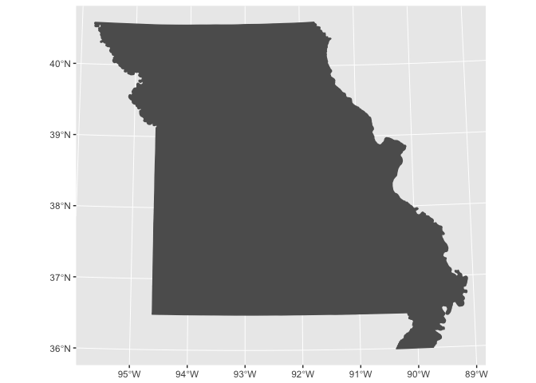

Lab 03 Notebook
================
Christopher Prener, Ph.D.
(February 11, 2018)

Introduction
------------

This is the replication notebook for Lab-03 from the course SOC 4650/5650: Introduction to GISc.

Project Set Up
--------------

``` r
knitr::opts_knit$set(root.dir = here::here())
```

Load Dependencies
-----------------

The following code loads the package dependencies for our analysis:

``` r
# tidyverse
library(ggplot2) # data plotting

# other packages
library(sf) # spatial data tools
```

    ## Linking to GEOS 3.6.1, GDAL 2.1.3, proj.4 4.9.3

Load Data
---------

The following code loads the data package and assigns our data to a data frame in our global environment:

``` r
moBoundary <- st_read("data/MO_BOUNDARY_State.shp", stringsAsFactors = FALSE)
```

    ## Reading layer `MO_BOUNDARY_State' from data source `/Users/chris/Dropbox/Professional/Teaching/SOC 5650 - GIS/2018-Spring/Content/Lecture-04/Lab-03/lab-03-replication/data/MO_BOUNDARY_State.shp' using driver `ESRI Shapefile'
    ## Simple feature collection with 1 feature and 9 fields
    ## geometry type:  MULTIPOLYGON
    ## dimension:      XY
    ## bbox:           xmin: 265164 ymin: 3986640 xmax: 847376.8 ymax: 4496652
    ## epsg (SRID):    26915
    ## proj4string:    +proj=utm +zone=15 +datum=NAD83 +units=m +no_defs

Part 1
------

### Question 8

The following code creates a basic plot of Missouri:

``` r
ggplot() +
  geom_sf(data = moBoundary, fill = "#5d5d5d", color = "#5d5d5d")
```



This code block saves the map to the `results` subfolder:

``` r
ggsave("results/missouriMap.png", dpi = 300)
```

    ## Saving 7 x 5 in image

We now have a very simple map of Missouri saved in our project.
